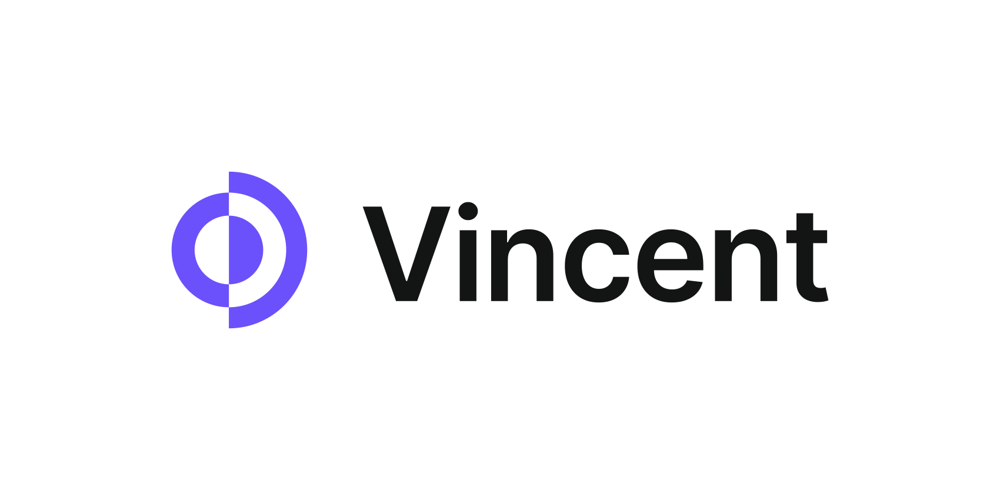

<!-- Improved compatibility of back to top link: See: https://github.com/othneildrew/Best-README-Template/pull/73 -->
<a id="readme-top"></a>
<!--
*** Thanks for checking out the Best-README-Template. If you have a suggestion
*** that would make this better, please fork the repo and create a pull request
*** or simply open an issue with the tag "enhancement".
*** Don't forget to give the project a star!
*** Thanks again! Now go create something AMAZING! :D
-->


<!-- PROJECT SHIELDS -->
<!--
*** I'm using markdown "reference style" links for readability.
*** Reference links are enclosed in brackets [ ] instead of parentheses ( ).
*** See the bottom of this document for the declaration of the reference variables
*** for contributors-url, forks-url, etc. This is an optional, concise syntax you may use.
*** https://www.markdownguide.org/basic-syntax/#reference-style-links
-->
[![Contributors][contributors-shield]][contributors-url]
[![Forks][forks-shield]][forks-url]
[![Stargazers][stars-shield]][stars-url]
[![Issues][issues-shield]][issues-url]
[![MIT License][license-shield]][license-url]
[![LinkedIn][linkedin-shield]][linkedin-url]


<!-- PROJECT LOGO -->
<br />
<div align="center">
  <a href="https://vincent-dellalibera.netlify.app">
    
  </a>

<h3 align="center">Portfolio Website #2</h3>

  <p align="center">
    A modern portfolio website using React and Sanity
    <br />
    <a href="https://github.com/gobwah/portfolio_website2"><strong>Explore the docs »</strong></a>
    <br />
    <br />
    <a href="https://vincent-dellalibera.netlify.app">View Demo</a>
    ·
    <a href="https://github.com/gobwah/portfolio_website2/issues">Report Bug</a>
    ·
    <a href="https://github.com/gobwah/portfolio_website2/issues">Request Feature</a>
  </p>
</div>


<!-- TABLE OF CONTENTS -->
<details>
  <summary>Table of Contents</summary>
  <ol>
    <li>
      <a href="#about-the-project">About The Project</a>
      <ul>
        <li><a href="#built-with">Built With</a></li>
      </ul>
    </li>
    <li>
      <a href="#getting-started">Getting Started</a>
      <ul>
        <li><a href="#prerequisites">Prerequisites</a></li>
        <li><a href="#installation">Installation</a></li>
      </ul>
    </li>
    <li><a href="#contributing">Contributing</a></li>
    <li><a href="#license">License</a></li>
    <li><a href="#contact">Contact</a></li>
    <li><a href="#acknowledgments">Acknowledgments</a></li>
  </ol>
</details>


<!-- ABOUT THE PROJECT -->
## About The Project

[![Portfolio Website #2 Screen Shot][product-screenshot]](https://example.com)

This is a modern full-stack portfolio website using React.js and Sanity.io

Project done thanks to [Javascript Mastery](https://github.com/adrianhajdin/project_professional_portfolio)

<p align="right">(<a href="#readme-top">back to top</a>)</p>


### Built With

|||
|-|-|
|[Sanity](https://www.sanity.io)||
|[React](https://reactjs.org/)||
|[Framer Motion](https://www.framer.com/motion/)||
|[Sass](https://sass-lang.com/)||
|[React Icons](https://react-icons.github.io/react-icons/)||

<p align="right">(<a href="#readme-top">back to top</a>)</p>


<!-- GETTING STARTED -->
## Getting Started

### Prerequisites

This is an example of how to list things you need to use the software and how to install them.
* npm
  ```sh
  npm install npm@latest -g
  ```

### Installation

1. Clone the repo
   ```sh
   git clone https://github.com/gobwah/portfolio_website2.git
   ```
2. Open console in `/backend_sanity`
3. Install Sanity
   ```sh
   npm install -g @sanity/cli
   sanity init
   ```
4. Open console in `/frontend_react`
5. Install dependencies
    ```sh
    npm install
    ```
6. Taking .env.example file as an example, create a .env file at the root of `/frontend_react` to store your Sanity information
   ```env
   REACT_APP_SANITY_PROJECT_ID = abcdefgh
   REACT_APP_SANITY_TOKEN = e8962t2zzsd5rggf1
   ```
7. In case you don't know where to find that, re-open a console in `/backend_sanity` and type
    ```sh
    sanity manage
    ```
    It will open a browser page where you can find quite easily your project ID. Then, on this page, go to `API` menu:
    * Go to `CORS origins` sub-menu and click on "+ Add CORS origin". Enter your localhost address (localhost:3000 by default), check "Allow credentials" and click "Save"
    * Go to `Tokens` and click on "+ Add API token". Give it a name, select "Editor" as a permission and click "Save".
8. Now you can go back to section 5.

<p align="right">(<a href="#readme-top">back to top</a>)</p>


<!-- CONTRIBUTING -->
## Contributing

Contributions are what make the open source community such an amazing place to learn, inspire, and create. Any contributions you make are **greatly appreciated**.

If you have a suggestion that would make this better, please fork the repo and create a pull request. You can also simply open an issue with the tag "enhancement".
Don't forget to give the project a star! Thanks again!

1. Fork the Project
2. Create your Feature Branch (`git checkout -b feature/AmazingFeature`)
3. Commit your Changes (`git commit -m 'Add some AmazingFeature'`)
4. Push to the Branch (`git push origin feature/AmazingFeature`)
5. Open a Pull Request

<p align="right">(<a href="#readme-top">back to top</a>)</p>


<!-- LICENSE -->
## License

Distributed under the MIT License. See `LICENSE.txt` for more information.

<p align="right">(<a href="#readme-top">back to top</a>)</p>


<!-- CONTACT -->
## Contact

Vincent DELLA-LIBERA - [@vincent-dellalibera](https://linkedin.com/in/vincent-dellalibera) - vincent.dellalibera@gmail.com

Project Link: [https://github.com/gobwah/portfolio_website2](https://github.com/gobwah/portfolio_website2)

<p align="right">(<a href="#readme-top">back to top</a>)</p>


<!-- ACKNOWLEDGMENTS -->
## Acknowledgments

* [@adrianhajdin (JS Mastery)](https://github.com/adrianhajdin)

<p align="right">(<a href="#readme-top">back to top</a>)</p>


<!-- MARKDOWN LINKS & IMAGES -->
<!-- https://www.markdownguide.org/basic-syntax/#reference-style-links -->
[contributors-shield]: https://img.shields.io/github/contributors/gobwah/portfolio_website2.svg?style=for-the-badge
[contributors-url]: https://github.com/gobwah/portfolio_website2/graphs/contributors

[forks-shield]: https://img.shields.io/github/forks/gobwah/portfolio_website2.svg?style=for-the-badge
[forks-url]: https://github.com/gobwah/portfolio_website2/network/members

[stars-shield]: https://img.shields.io/github/stars/gobwah/portfolio_website2.svg?style=for-the-badge
[stars-url]: https://github.com/gobwah/portfolio_website2/stargazers

[issues-shield]: https://img.shields.io/github/issues/gobwah/portfolio_website2.svg?style=for-the-badge
[issues-url]: https://github.com/gobwah/portfolio_website2/issues

[license-shield]: https://img.shields.io/github/license/gobwah/portfolio_website2.svg?style=for-the-badge
[license-url]: https://github.com/gobwah/portfolio_website2/blob/master/LICENSE.txt

[linkedin-shield]: https://img.shields.io/badge/-LinkedIn-black.svg?style=for-the-badge&logo=linkedin&colorB=555
[linkedin-url]: https://linkedin.com/in/vincent-dellalibera

[product-screenshot]: frontend_react/src/assets/PortfolioWebsite2Screenshot.jpg